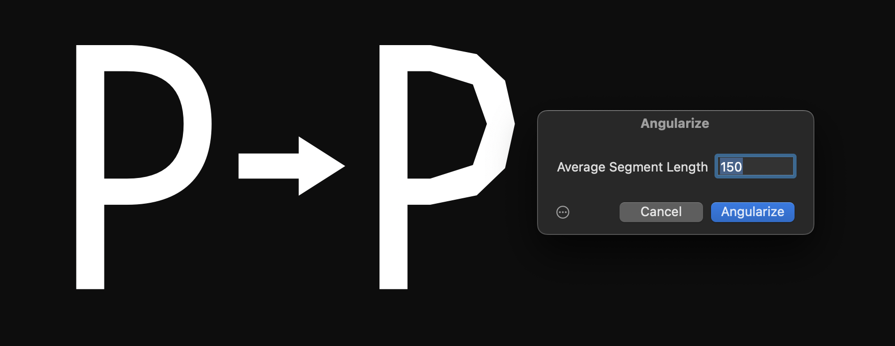

# Angularize

*Filter > Angularize* subdivides curves into straight line segments.

Pick an average desired segment length, and curve segments will be turned into a series of line segments.

### Installation

Install the filter through *Window > Plugin Manager > Plugins.* Make sure Python is installed in the Modules section. After installation, you need to restart the app.

### Usage

In Edit view, pick *Angularize* from the *Filter* menu. But you can also add it as a *Filter* custom parameter in *Font Info > Exports,* with a value such as `Angularize; segmentLength: 100` (sample segment length 100, adjust to your needs).

### Requirements

Angularize requires Glyphs 3 or later. Tested in version 3.3.1. If you have an older version of the app, please upgrade and/or update your app.

### License

Written by Rainer Erich Scheichelbauer, based on sample code from the GlyphsSDK.

Licensed under the Apache License, Version 2.0 (the "License");
you may not use this file except in compliance with the License.
You may obtain a copy of the License at

http://www.apache.org/licenses/LICENSE-2.0

See the License file included in this repository for further details.
